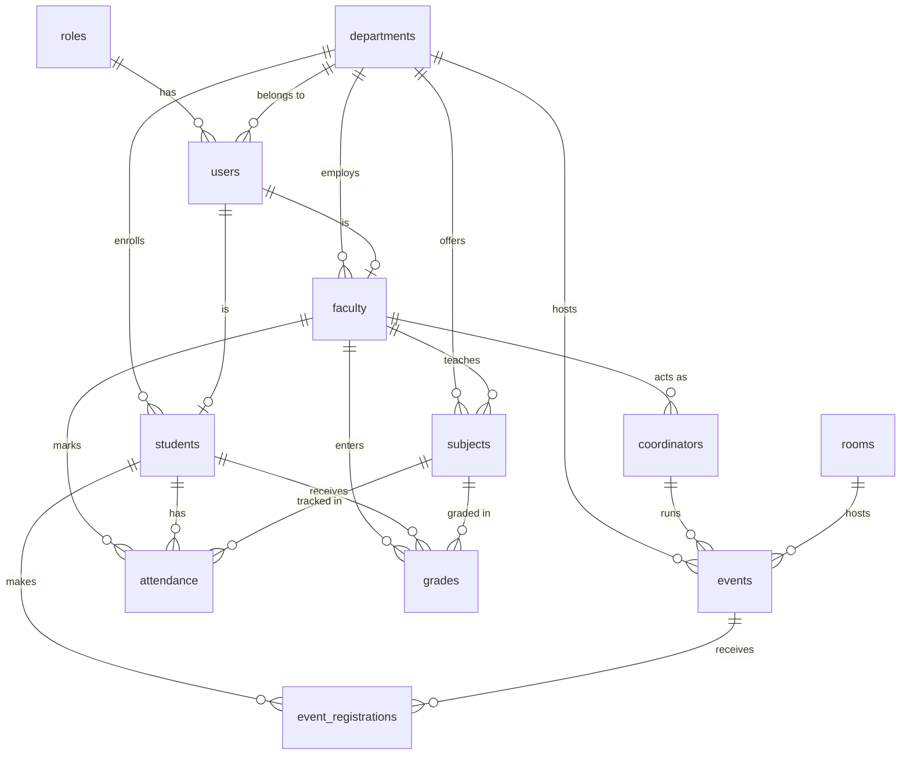

<div align="center">

# 🎓 Campus Connect

### A role-based University Campus Management System (ERP)

Secure, database-enforced, production-grade — built with React, TypeScript & Supabase.


</div>

---

## 📑 Table of Contents

1. [Project Overview](#-project-overview)
2. [Why Campus Connect Was Built](#-why-campus-connect-was-built)
3. [Key Features](#-key-features)
4. [What Makes This Project Different](#-what-makes-this-project-different)
5. [Tech Stack](#-tech-stack)
6. [System Architecture](#-system-architecture)
7. [Project Structure](#-project-structure)
8. [Database Design](#-database-design)
9. [Authentication & Authorization Flow](#-authentication--authorization-flow)
10. [Frontend → Backend → Database Data Flow](#-frontend--backend--database-data-flow)
11. [Role-Based Access Control](#-role-based-access-control)
12. [Core Modules & Features](#-core-modules--features)
13. [Screenshots](#-screenshots)
14. [Installation & Local Setup](#-installation--local-setup)
15. [Environment Variables](#-environment-variables)
16. [Running the Project](#-running-the-project)
17. [Deployment](#-deployment)
18. [Security Features](#-security-features)
19. [Performance Optimizations](#-performance-optimizations)
20. [Design Decisions](#-important-design-decisions)
21. [What's New / Highlights](#-whats-new--highlights)
22. [Why This Project Is Resume-Worthy](#-why-this-project-is-resume-worthy)
23. [Future Enhancements](#-future-enhancements)
24. [Contributing](#-contributing)
25. [License](#-license)
26. [Contact](#-contact)

---

## 🧭 Project Overview

**Campus Connect** is a full-stack, role-based **Campus/University Management System (ERP)** that models how a real institution runs: departments, faculty, students, coordinators, subjects, rooms, events, attendance, grades, announcements, and reports — each behind a workspace tailored to the signed-in user's role.

It is a **React + TypeScript** single-page application backed by **Supabase (PostgreSQL)**. Its defining characteristic is that **authorization lives in the database** via PostgreSQL **Row Level Security (RLS)** — the UI hides what a role can't use, and the database *refuses* what a role isn't allowed to read or write. Security therefore does not depend on the client.

> **Roles:** `Admin` · `Coordinator` · `Faculty` · `Student`

---

## 💡 Why Campus Connect Was Built

Most student "college ERP" projects are CRUD demos with mock data, client-side role checks, and no real security model. Campus Connect was built to be the opposite: a project that demonstrates **production engineering practices** — a normalized relational schema, database-enforced RBAC, real JWT auth with session persistence, a typed service layer, and file storage — while remaining clean enough to explain end-to-end in an interview.

The goal: a portfolio project that a recruiter or engineer immediately reads as **production-ready**, not a class assignment.

---

## ✨ Key Features

- 🔐 **Real authentication** — email **or** username + password via Supabase Auth (JWT), with email verification.
- ♻️ **Session persistence** — sessions survive refresh/reopen with silent token refresh; the role is always re-read from the database.
- 🛡️ **Database-enforced RBAC** — 15 tables protected by RLS policies; 4 roles with distinct permissions.
- 📊 **Role-specific dashboards** — every dashboard renders **live, permission-scoped** data.
- 🧩 **10+ live CRUD modules** — Users, Departments, Subjects, Rooms, Events, Attendance, Grades, Announcements, Reports, Analytics.
- 🖼️ **Profile photo upload** — click-to-upload avatars via Supabase Storage (JPG/PNG/WEBP ≤ 5MB), updating everywhere instantly.
- 🔎 **Search, filters & pagination-ready lists**, with polished loading / empty / error states.
- 🎨 **Handcrafted light + dark themes** — a warm "ivory/ink" light theme and a warm-charcoal dark theme, driven by a token-based design system.
- 📱 **Fully responsive** — drawer sidebar, stacking grids, scroll-safe tables, touch-friendly controls.
- 🚀 **One-click demo** — "Explore as Admin/Coordinator/Faculty/Student" buttons sign in through the real auth flow (no passwords shown).

---

## 🌟 What Makes This Project Different

| Typical college ERP | Campus Connect |
| --- | --- |
| Mock data / local arrays | 100% live Supabase data, nothing hardcoded |
| Role checks only in React | **RLS policies in PostgreSQL** — the real boundary |
| Flat, unnormalized tables | **Normalized 15-table schema** (3NF) with FKs, indexes, triggers |
| "Login" that's just a boolean | JWT sessions, refresh tokens, email verification, deactivation |
| Profile pic = pasted URL | **File upload to object storage** with owner-scoped policies |
| One generic dashboard | Four **role-specific** dashboards from live queries |
| Fetch calls scattered in components | **Typed repository/service layer** over PostgREST |

---

## 🛠 Tech Stack

### Frontend
| Tool | Purpose |
| --- | --- |
| **React 18** | UI library |
| **TypeScript 5.5** | Type safety across the app |
| **React Router v6** | Client-side routing & protected routes |
| **Framer Motion** | Animations & transitions |
| **Lucide React** | Icon system |
| **React Hot Toast** | Toast notifications |
| **Zod** | Schema validation (email/password rules) |

### Backend / Database / Auth / Storage
| Concern | Technology |
| --- | --- |
| **Backend** | Supabase (managed) — no custom server |
| **Database** | PostgreSQL (via Supabase) |
| **API layer** | PostgREST (auto-generated REST over the schema) |
| **Authentication** | Supabase Auth (GoTrue) — JWT, bcrypt, refresh tokens, email confirmation |
| **Authorization** | PostgreSQL **Row Level Security** + `SECURITY DEFINER` helper functions |
| **Storage** | Supabase Storage (`avatars` bucket, owner-scoped policies) |

### State / Styling / Build
| Concern | Technology |
| --- | --- |
| **State management** | Zustand (auth, theme) + local component state |
| **Styling** | Tailwind CSS 3.4 with a custom token-based design system (light + dark) |
| **Build tool** | Vite 5 |
| **Language/Lint** | TypeScript, ESLint |
| **Deployment** | Static frontend (Vercel/Netlify/Cloudflare Pages) + hosted Supabase |

---

## 🏗 System Architecture

Campus Connect is a **Backend-as-a-Service** architecture. There is no hand-written server; the React client talks directly to Supabase over HTTPS, and **PostgreSQL RLS is the security boundary**.

```
┌──────────────────────────────────────────────────────────┐
│                     React SPA (Vite)                      │
│                                                           │
│   Pages ──▶ Zustand stores / hooks ──▶ Service layer      │
│                                        (services/…)       │
│                                            │              │
│                       lib/supabase.ts (REST + Auth + RPC) │
└────────────────────────────────┬─────────────────────────┘
                                  │ HTTPS (JWT)
             ┌────────────────────┼─────────────────────┐
             ▼                    ▼                     ▼
     Supabase Auth        PostgREST (REST)       Supabase Storage
      (GoTrue/JWT)        over the schema          (avatars)
             │                    │                     │
             └──────────┬─────────┘                     │
                        ▼                               │
               PostgreSQL  ◀── Row Level Security ──────┘
        (15 tables · FKs · indexes · triggers · functions)
```

**Concise explanation:** UI components never call `fetch` directly — they go through a **typed repository layer** (`services/entities.ts`) built on a thin Supabase client (`lib/supabase.ts`). Every request carries the user's JWT; PostgreSQL evaluates RLS policies per row using `SECURITY DEFINER` helper functions (`app_role()`, `app_user_id()`, `app_student_id()`, `app_faculty_id()`, `app_department_id()`) that resolve the caller's identity without causing policy recursion.

### Why Supabase over a traditional Express backend

A custom Express + Postgres backend would require hand-writing (and securing) auth, JWT issuance/refresh, password hashing, an ORM, REST endpoints, validation, and role middleware — a large surface area for bugs. Supabase provides all of that as managed infrastructure:

- **bcrypt password hashing & JWTs** → GoTrue, not app code.
- **REST API** → PostgREST generates it from the schema.
- **Authorization** → RLS policies live *in the database*, so they can't be bypassed by a crafted client request.
- **SQL-injection safety** → PostgREST parameterizes queries.

The result is **less code, a smaller attack surface, and security enforced at the data layer** — while keeping the freedom to write raw SQL, functions, triggers, and policies.

---

## 📁 Project Structure

```
Campus-connect/
├── public/                     # Static assets (logo)
├── src/
│   ├── components/
│   │   ├── auth/               # AuthForm (login/signup, demo, verify)
│   │   ├── layout/             # AppLayout (route guard), Header, Sidebar
│   │   ├── dashboard/          # dashboard cards
│   │   └── ui/                 # Button, Input, Card, Badge, Table,
│   │                           #   Modal, Avatar, ThemeToggle
│   ├── pages/                  # One file per route/module
│   │   ├── LandingPage.tsx     AuthPage.tsx      DashboardPage.tsx
│   │   ├── UsersPage.tsx       DepartmentsPage.tsx  SubjectsPage.tsx
│   │   ├── RoomsPage.tsx       EventsPage.tsx    GradesPage.tsx
│   │   ├── AttendancePage.tsx  CoordinatorAttendancePage.tsx
│   │   ├── AnnouncementsPage.tsx  ReportsPage.tsx   AnalyticsPage.tsx
│   │   ├── AdminPage.tsx       SettingsPage.tsx
│   ├── services/
│   │   └── entities.ts         # Typed repository layer (one repo per table)
│   ├── store/
│   │   ├── authStore.tsx       # Auth: login, register, session restore, refresh
│   │   └── themeStore.ts       # Light/dark/system theme
│   ├── lib/
│   │   ├── supabase.ts         # REST helpers, auth, session, storage, RPC
│   │   └── utils.ts            # cn(), date/format helpers
│   ├── types/                  # Shared TypeScript types
│   ├── App.tsx                 # Routes + Toaster + session bootstrap
│   ├── main.tsx                # Entry
│   └── index.css               # Tailwind base + theme canvas
├── supabase/
│   ├── migrations/
│   │   ├── 0001_campus_erp_baseline.sql   # schema + RLS + functions + seed
│   │   ├── 0002_avatars_storage.sql       # storage bucket + policies
│   │   └── 0003_username_login_rpc.sql    # username → email RPC
│   └── seed/
│       └── demo_seed.sql                  # demo roles + sample data
├── tailwind.config.js          # Design tokens (colors, shadows, radius)
├── vite.config.ts
├── .env.example
└── README.md
```

**Architecture layers:** `UI components → stores / page hooks → repository layer → Supabase client → PostgREST + RLS`.

---

## 🗄 Database Design

The schema is normalized to **3NF** across **15 tables**. Identity is owned by Supabase Auth (`auth.users`); the application profile lives in `public.users`, linked by `auth_user_id`. A trigger auto-creates a `users` row on signup.

### Major tables

| Table | Purpose | Key relationships |
| --- | --- | --- |
| `roles` | admin / coordinator / faculty / student | referenced by `users.role_id` |
| `departments` | academic departments | `hod_id → users` |
| `users` | app profile (name, email, role, dept, status, avatar) | `role_id → roles`, `department_id → departments`, `auth_user_id → auth.users` |
| `faculty` | faculty profile | `user_id → users`, `department_id → departments` |
| `students` | student profile (roll no, semester, section) | `user_id → users`, `department_id → departments` |
| `coordinators` | a faculty member acting as coordinator | `faculty_id → faculty`, `department_id → departments` |
| `subjects` | courses (code, semester, credits) | `department_id`, `faculty_id` |
| `rooms` | physical rooms (capacity, type, status) | — |
| `events` | campus events | `coordinator_id`, `room_id`, `department_id` |
| `event_registrations` | student ↔ event | `student_id`, `event_id` |
| `attendance` | per-subject attendance | `student_id`, `subject_id`, `faculty_id` |
| `grades` | internal/external/assignment/lab + CGPA | `student_id`, `subject_id`, `faculty_id` |
| `announcements` | campus-wide or department notices | `department_id`, `created_by` |
| `reports` | generated report metadata | `generated_by`, `department_id` |
| `audit_logs` | action log | `user_id` |

### Entity relationships



Full DDL — foreign keys, cascade rules, indexes, check constraints, RLS policies, helper functions, and the signup trigger — lives in [`supabase/migrations/0001_campus_erp_baseline.sql`](supabase/migrations/0001_campus_erp_baseline.sql).

---

## 🔐 Authentication & Authorization Flow

```
Sign up ──▶ Supabase Auth issues account
        └─▶ trigger creates public.users row (role from metadata)
        └─▶ verification email sent  ──▶ user clicks link ──▶ verified

Sign in (email OR username + password)
   └─ username? ── RPC email_for_username() ── resolve to email
   └─ Supabase Auth returns JWT (access + refresh)
   └─ profile + role fetched from users ⋈ roles
   └─ role-specific dashboard renders

On every reload
   └─ authStore.initialize() restores session (silent refresh if expired)
   └─ RE-FETCHES role from DB (never trusts stale client state)
   └─ deactivated (status != 'active') → access denied
   └─ AppLayout shows a loader until restore completes (no redirect flash)
```

**Authorization** is enforced by RLS. Example — a student can only read their own grades:

```sql
create policy grades_select on grades for select to authenticated
using (
  app_role() = 'admin'
  or student_id = app_student_id()
  or faculty_id = app_faculty_id()
  or exists (select 1 from subjects s
             where s.id = grades.subject_id
             and s.department_id = app_department_id()
             and app_role() = 'coordinator')
);
```

Helper functions are `SECURITY DEFINER` (they read `users` with RLS bypassed) to **avoid infinite policy recursion**.

---

## 🔄 Frontend → Backend → Database Data Flow

Example: **Faculty records a grade**

```
GradesPage (form submit)
   │
   ▼
gradesRepo.create(payload)          ← services/entities.ts (typed repository)
   │
   ▼
dbInsert('grades', payload)         ← lib/supabase.ts (adds JWT auth header)
   │  POST /rest/v1/grades
   ▼
PostgREST                            ← validates columns/types
   │
   ▼
PostgreSQL RLS: grades_faculty_write ← checks faculty_id = app_faculty_id() OR admin
   │  (insert succeeds only if authorized)
   ▼
Row persisted ──▶ UI re-fetches ──▶ toast "Grade recorded"
```

The same path (repository → client → PostgREST → RLS) governs **every** read and write in the app.

---

## 👥 Role-Based Access Control

| Capability | Admin | Coordinator | Faculty | Student |
| --- | :---: | :---: | :---: | :---: |
| User management (roles, dept, activate/deactivate) | ✅ | — | — | — |
| Departments / Rooms | ✅ (CRUD) | read | read | read |
| Subjects | ✅ | ✅ | read | read |
| Events | ✅ | ✅ | read | read |
| Attendance | all | dept reports | mark own subjects | view own |
| Grades | all | dept reports | enter own subjects | view own |
| Announcements | ✅ | ✅ | ✅ | read |
| Reports & Analytics | ✅ | reports | — | — |
| Dashboard | Admin | Coordinator | Faculty | Student |

The React UI mirrors these rules (role-conditional sidebar, route guards), but **the database is the final authority** — a request from the wrong role is rejected by RLS regardless of the UI.

---

## 🧩 Core Modules & Features

- **Authentication** — email/username login, signup with email verification, session persistence, silent refresh, protected routes, account deactivation.
- **User Management** *(Admin)* — searchable/filterable user list, assign role & department, activate/deactivate.
- **Departments** — CRUD with head-of-department assignment.
- **Subjects** — CRUD with department, semester, credits, faculty assignment.
- **Rooms** — CRUD for physical rooms (capacity, type, availability) with type filter.
- **Events** — CRUD with room/department assignment, status, date validation, filters.
- **Attendance** — faculty mark; students view own with attendance %.
- **Grades** — faculty enter internal/external/assignment/lab marks + CGPA; students view own.
- **Announcements** — campus-wide or department-scoped notices.
- **Reports & Analytics** — live aggregate counts and distribution charts.
- **Profile & Settings** — editable profile, avatar upload to Supabase Storage.
- **Cross-cutting** — search, filters, loading/empty/error states, toasts, confirmation dialogs, light/dark themes, responsive layout.

---

## 📸 Screenshots

> _Add images to a `docs/` or `screenshots/` folder and update the paths below._

| Light Theme | Dark Theme |
| --- | --- |
|  |  |

| Login / Explore Demo | User Management |
| --- | --- |
|  |  |

| Grades | Mobile |
| --- | --- |
|  |  |

---

## ⚙️ Installation & Local Setup

### Prerequisites
- **Node.js 18+**
- A free **Supabase** project

### 1. Clone & install
```bash
git clone https://github.com/<your-username>/campus-connect.git
cd campus-connect
npm install
```

### 2. Configure environment
```bash
cp .env.example .env
# then fill in your Supabase URL + anon key
```

### 3. Apply the database schema
In the Supabase **SQL Editor**, run in order:
```text
supabase/migrations/0001_campus_erp_baseline.sql   # schema + RLS + functions + seed
supabase/migrations/0002_avatars_storage.sql       # avatars storage bucket + policies
supabase/migrations/0003_username_login_rpc.sql    # username → email login
```

### 4. Create your first admin
- **Authentication → Providers → Email**: enable **Confirm email** (production) — or disable for quick local testing.
- Sign up through the app, then promote yourself:
```sql
update users set role_id = (select id from roles where role_name = 'admin')
where email = 'you@example.com';
```

### 5. (Optional) Seed demo accounts
Create 4 users in **Authentication → Users** (tick *Auto Confirm*): `admin@demo.campus`, `coordinator@demo.campus`, `faculty@demo.campus`, `student@demo.campus`, then run `supabase/seed/demo_seed.sql`. The login page's **"Explore as …"** buttons sign in with these.

---

## 🔑 Environment Variables

`.env.example`:
```env
# Supabase project URL, e.g. https://xxxx.supabase.co
VITE_SUPABASE_URL=

# Public anon key — safe to expose in the browser (RLS enforces access)
VITE_SUPABASE_ANON_KEY=
```

| Variable | Scope | Notes |
| --- | --- | --- |
| `VITE_SUPABASE_URL` | client | Project URL |
| `VITE_SUPABASE_ANON_KEY` | client | Public anon key (RLS-protected) |
| `SUPABASE_SERVICE_ROLE_KEY` | **server only** | Never bundle in the frontend — for Edge Functions/admin scripts only |

---

## ▶️ Running the Project

```bash
npm run dev       # start dev server (Vite)
npm run build     # type-check + production build → dist/
npm run preview   # preview the production build
npm run lint      # run ESLint
```

---

## 🚀 Deployment

**Frontend** (static SPA):
```bash
npm run build     # outputs dist/
```
Deploy `dist/` to **Vercel**, **Netlify**, or **Cloudflare Pages**, and set `VITE_SUPABASE_URL` and `VITE_SUPABASE_ANON_KEY` in the host's environment settings.

**Backend:** Supabase is already hosted — apply the migrations to your production project and enable **Confirm email**. For admin-provisioned accounts, deploy a Supabase **Edge Function** using the `service_role` key (`/auth/v1/admin/users` with `email_confirm: true`).

> 🔗 **Live demo:** _add your deployment URL here_

---

## 🛡 Security Features

- **Row Level Security** on all 15 tables — the real authorization boundary.
- **JWT authentication** with refresh tokens and email verification.
- **bcrypt password hashing** (handled by Supabase Auth — never in app code).
- **`SECURITY DEFINER` helper functions** to prevent RLS recursion.
- **Owner-scoped Storage policies** — users can only write avatars in their own `auth.uid()` folder.
- **Input validation** via Zod (email format, strong-password rules).
- **Account deactivation** — `status = 'inactive'` blocks login and session restore.
- **Least-privileged keys** — only the anon key ships to the browser; the service-role key is server-only.
- **Parameterized queries** via PostgREST (SQL-injection safe).

---

## ⚡ Performance Optimizations

- **Header-based counts** — dashboard/report metrics use PostgREST `HEAD` + `Content-Range` (`dbCount`) so **no rows are transferred** to compute totals.
- **Indexed foreign keys & common filters** on every relationship-heavy column.
- **FK-hinted embeds** — joins use explicit relationship hints to avoid ambiguous-relationship failures and extra round-trips.
- **Silent token refresh** — avoids forcing re-login and redundant auth calls.
- **Scoped re-renders** — Zustand selectors and local state limit re-render blast radius.
- **Consistent loading/empty/error states** for perceived performance.
- **Static SPA build** — cacheable, CDN-deployable assets via Vite.

---

## 🧠 Important Design Decisions

- **Authorization in the database, not the client.** RLS is the source of truth; the UI is a convenience layer. This is the single most important decision and the hardest to get right (recursion, helper functions, per-role policies).
- **Separate `public.users` from `auth.users`.** Keeps app profile data (role, department, avatar, status) decoupled from the auth provider, linked by `auth_user_id`, and auto-provisioned by a trigger.
- **Typed repository layer.** Pages never call `fetch`; they use `services/entities.ts`. Data access is centralized, typed, and testable.
- **Role read on every load.** The role is re-fetched from the DB on login and session restore, so changing a role in SQL takes effect on the next reload — no stale cache.
- **Token-based design system.** Light and dark themes are driven by Tailwind color/shadow tokens, so re-theming is a token change, not a per-component rewrite.

### How it scales
- **Reads scale** with Postgres indexes + PostgREST pagination (`Range`/`Content-Range`).
- **Auth scales** on managed Supabase Auth.
- **New modules** are additive: a table + RLS policies + a repository + a page — no server redeploy.
- **Privileged operations** (bulk user provisioning, emails) move to **Edge Functions** without changing the client architecture.

---

## 🆕 What's New / Highlights

Features that set this apart from a typical college ERP:

- 🔒 **Database-enforced RBAC (RLS)** — not client-side `if (role === 'admin')`.
- 🧾 **Normalized 15-table schema** with triggers, functions, constraints, and indexes.
- 🔁 **Session persistence + silent refresh** with a "restore before render" gate (no redirect flash on reload).
- 🧑‍🎓 **Username *or* email login** via a `SECURITY DEFINER` RPC.
- 📷 **Avatar uploads to object storage** with owner-scoped policies (replaced the naive "paste a URL" approach).
- 🧪 **One-click demo accounts** that authenticate through the real flow.
- 🎨 **Two handcrafted themes** from a shared design-token system.
- 🐛 **Real debugging depth** — e.g. diagnosing and fixing a PostgREST `PGRST201` ambiguous-embed caused by dual foreign keys between `users` and `departments`.

---

## 💼 Why This Project Is Resume-Worthy

It demonstrates **real-world engineering practices**, not tutorial patterns:

- **Security-first design** — authorization enforced at the data layer with RLS.
- **Relational data modeling** — normalization, foreign keys, cascade rules, indexes.
- **Clean architecture** — layered UI → repository → client → API → DB.
- **Auth engineering** — JWT lifecycle, refresh, verification, deactivation.
- **Debugging & tradeoffs** — documented root-cause fixes and platform decisions.
- **Product polish** — responsive, themed, accessible, with proper states and feedback.

**Talking points for interviews:**
> "Authorization lives in PostgreSQL via Row Level Security, resolved through `SECURITY DEFINER` functions to avoid policy recursion. The client is layered so data access is typed and centralized, and the role is re-read from the database on every load so it's never stale. I chose Supabase over a custom Express backend to move auth, hashing, and the REST layer into managed infrastructure and keep security in the database."

---

## 🔭 Future Enhancements

- Supabase **Edge Function** for admin user provisioning + password-reset emails.
- **Realtime** attendance/announcements via Supabase Realtime subscriptions.
- **CSV/PDF export** for reports.
- **Timetable & room-booking conflict detection.**
- **Audit-log viewer** UI.
- **Automated tests** (Vitest + Testing Library) and CI.
- **Code-splitting** per route to trim initial bundle size.

---

## 🤝 Contributing

Contributions are welcome!

1. Fork the repository
2. Create a branch: `git checkout -b feature/your-feature`
3. Commit: `git commit -m "feat: add your feature"`
4. Push: `git push origin feature/your-feature`
5. Open a Pull Request

Please keep the layered architecture (pages → services → client) and add RLS policies for any new tables.

---

## 📄 License

Released under the **MIT License**. See [`LICENSE`](LICENSE) for details.

---

## 📬 Contact

**Yaswanth**
- GitHub: [@Yaswanth8118](https://github.com/Yaswanth8118)
- Project: [Campus Connect](https://github.com/Yaswanth8118/Campus-connect)

<div align="center">

Built with attention to **security, data integrity, and clean architecture**.

⭐ If this project helped or impressed you, consider starring the repo.

</div>
