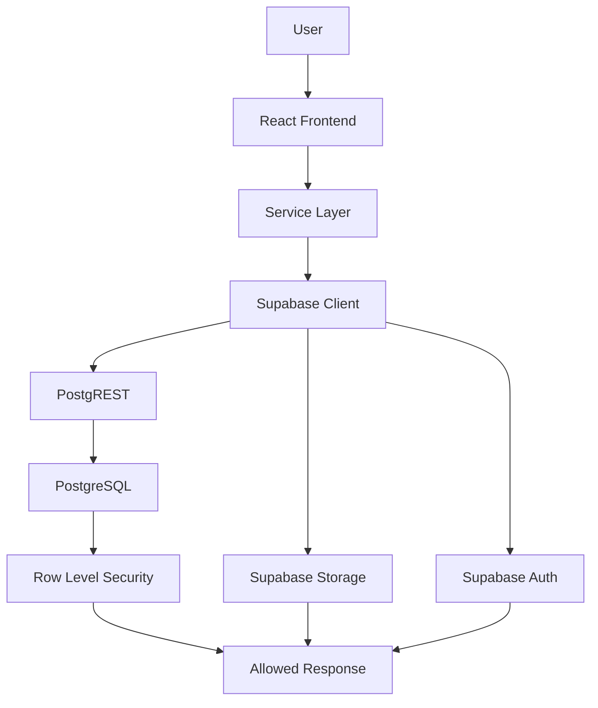
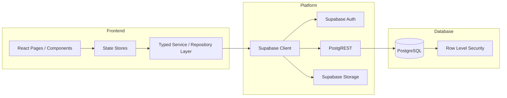

<div align="center">

# Campus Connect

### Secure, role-based university ERP built with React, TypeScript, Supabase, and PostgreSQL RLS


</div>

---

## 1. Project Overview

Campus Connect is a full-stack university campus management ERP for administrators, coordinators, faculty members, and students.

It centralizes academic and administrative workflows such as authentication, user management, departments, subjects, rooms, events, attendance, grades, announcements, reports, and analytics.

The project is designed to show a production-inspired architecture rather than a demo-only CRUD app. The browser is only one part of the system; authorization is enforced in the database through PostgreSQL Row Level Security.

High-level flow:

- A user signs in with email or username.
- React loads the role-specific workspace.
- The service layer sends typed requests through Supabase.
- PostgreSQL applies RLS policies to every query.
- The client receives only the rows it is allowed to see.

## 2. Why I Built This

Most student ERP projects stop at mock data, local state, and client-side role checks. That approach is useful for learning, but it does not reflect how real systems are secured or structured.

Campus Connect was built to demonstrate stronger engineering practices:

- authorization enforced in PostgreSQL instead of React
- a normalized relational model instead of JSON fixtures
- real authentication with JWT sessions and refresh tokens
- a typed repository layer instead of scattered fetch calls
- storage-backed profile images instead of pasted URLs
- repeatable database migrations instead of manual setup

The goal is to look and behave like a real internal platform, not a college assignment.

## 3. Key Features

### Authentication and access

- Email login and username login
- Secure signup with verification flow
- Session persistence with silent token refresh
- Role reloading from the database on restore

### Role-specific workspaces

- Admin dashboard for global management
- Coordinator workspace for department oversight
- Faculty workspace for attendance and grades
- Student workspace for academic visibility

### Platform capabilities

- Live CRUD operations across the main modules
- Search, filtering, and responsive data tables
- Light and dark theme support
- Avatar upload through Supabase Storage
- Polished empty, loading, and error states

## 4. How It Works

The application is intentionally layered so each part has one responsibility.



Request path:

1. The user interacts with a page in React.
2. The page calls the typed service or repository layer.
3. The service layer calls the Supabase client.
4. Supabase routes auth, database, and storage requests.
5. PostgreSQL evaluates RLS policies for the current JWT.
6. The database returns only authorized rows.

## 5. Project Architecture

Campus Connect follows a backend-as-a-service model. There is no custom Express server. The frontend talks directly to Supabase, and PostgreSQL remains the enforcement point for access control.



### Frontend

The UI is built with React, TypeScript, Vite, Tailwind CSS, React Router, Framer Motion, and Lucide icons. Pages are role-aware and use shared UI components.

### Backend platform

Supabase provides authentication, REST access through PostgREST, and file storage. The app does not depend on a custom backend service.

### Database

PostgreSQL stores the relational model, authorization policies, helper functions, and application data.

### Authentication

Supabase Auth handles JWT sessions, password verification, refresh tokens, and email confirmation.

### Storage

Supabase Storage is used for avatar uploads with owner-scoped policies.

## 6. Tech Stack

### Frontend

| Area | Stack |
| --- | --- |
| UI library | React 18 |
| Language | TypeScript |
| Build tool | Vite |
| Routing | React Router |
| Animation | Framer Motion |
| Icons | Lucide React |
| Styling | Tailwind CSS |

### Backend

| Area | Stack |
| --- | --- |
| App platform | Supabase |
| API layer | PostgREST |
| Auth | Supabase Auth |
| Database | PostgreSQL |
| File storage | Supabase Storage |

### Security

| Area | Stack |
| --- | --- |
| Row-level authorization | PostgreSQL RLS |
| Session model | JWT + refresh tokens |
| Privileged SQL helpers | SECURITY DEFINER functions |
| Signup verification | Email confirmation |

### Styling and deployment

| Area | Stack |
| --- | --- |
| Styling system | Tailwind CSS |
| Hosting | Vercel |
| Backend hosting | Supabase |

## 7. Folder Structure

Only the important folders are shown below.

```text
Campus-connect/
├── src/
│   ├── components/
│   │   ├── auth/
│   │   ├── layout/
│   │   └── ui/
│   ├── pages/
│   ├── services/
│   ├── store/
│   ├── lib/
│   └── types/
├── supabase/
│   ├── migrations/
│   └── seed/
├── public/
├── index.html
├── vite.config.ts
├── tailwind.config.js
└── README.md
```

## 8. Database Overview

The database is normalized and organized around the core campus workflow instead of being built as a flat CRUD dump.

Main data domains:

- identity and roles
- departments and academic ownership
- faculty, students, and coordinators
- subjects, rooms, and events
- attendance, grades, reports, and announcements

The relationships are mostly foreign-key driven, with users linked to roles and departments, subjects linked to departments and faculty, and operational records linked back to the relevant actor or owner.

This structure reduces duplication, keeps writes consistent, and makes RLS policies easier to reason about.

## 9. Role-Based Access Control

RLS is the actual authorization boundary. The UI mirrors permissions, but the database decides access.

| Capability | Admin | Coordinator | Faculty | Student |
| --- | :---: | :---: | :---: | :---: |
| User management | Yes | No | No | No |
| Role management | Yes | No | No | No |
| Department management | Yes | Yes | No | No |
| Events | Yes | Yes | Limited | View only |
| Attendance | Yes | Department scope | Own subjects | View own |
| Grades | Yes | Department scope | Own subjects | View own |
| Announcements | Yes | Yes | Yes | View only |
| Reports and analytics | Yes | Department scope | Limited | View only |
| Dashboard access | Yes | Yes | Yes | Yes |

## 10. Security

- JWT authentication is used for all signed-in sessions.
- PostgreSQL Row Level Security is the core authorization layer.
- SECURITY DEFINER helper functions are used where database lookups must bypass recursion.
- Storage policies restrict avatar uploads to the correct owner scope.
- Least privilege is enforced by shipping only the public anon key to the browser.

## 11. Installation

### Prerequisites

- Node.js 18 or later
- A Supabase project

### Clone the repository

```bash
git clone https://github.com/Yaswanth8118/Campus-connect.git
cd Campus-connect
```

### Install dependencies

```bash
npm install
```

### Environment variables

Create a `.env` file from `.env.example` and set:

```env
VITE_SUPABASE_URL=
VITE_SUPABASE_ANON_KEY=
```

### Start the development server

```bash
npm run dev
```

### Additional scripts

```bash
npm run build
npm run preview
npm run lint
```

## 12. Deployment

The frontend is deployed as a static application on Vercel.

Deployment steps:

1. Run `npm run build` to produce the production bundle.
2. Deploy the generated `dist/` directory to Vercel.
3. Set `VITE_SUPABASE_URL` and `VITE_SUPABASE_ANON_KEY` in the Vercel environment settings.
4. Apply the Supabase migrations to the target project.

Supabase handles the authentication, storage, and database side of the deployment. No separate backend server is required.

## 13. Future Improvements

- Realtime attendance updates
- Realtime announcement delivery
- CSV export for reports
- PDF export for selected views
- Audit log viewer
- Timetable and room conflict detection
- Route-level code splitting for smaller bundles
- Automated tests with Vitest and Testing Library

## 14. Contributing

Contributions are welcome.

1. Fork the repository.
2. Create a branch for your change.
3. Commit your work with a clear message.
4. Push the branch to your fork.
5. Open a pull request.

Please keep changes consistent with the layered architecture and add database policies for any new protected data.

## 15. License

This project is licensed under the MIT License. See [LICENSE](LICENSE) for details.

## 16. Contact

**Yaswanth**

- GitHub: [@Yaswanth8118](https://github.com/Yaswanth8118)
- Project repository: [Campus Connect](https://github.com/Yaswanth8118/Campus-connect)
