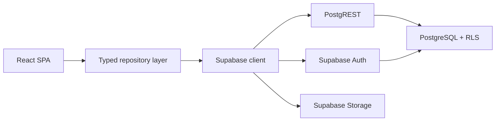

<div align="center">

# 🎓 Campus Connect

### A role-based University Campus Management System (ERP)

Secure, database-enforced, production-grade — built with React, TypeScript & Supabase.


</div>

---

## Overview

Campus Connect is a full-stack campus management ERP for Admin, Coordinator, Faculty, and Student roles. It uses Supabase and PostgreSQL Row Level Security as the real authorization boundary, so the UI only shows what the database already permits.

If you want the shortest summary: it is a typed React app with live data, role-based dashboards, secure auth, and database-enforced access control.

## Quick Start

### Install
```bash
git clone https://github.com/Yaswanth8118/Campus-connect.git
cd campus-connect
npm install
```

### Configure
```bash
cp .env.example .env
```

Fill in:
```env
VITE_SUPABASE_URL=
VITE_SUPABASE_ANON_KEY=
```

### Run
```bash
npm run dev
```

## Key Features

- Real authentication with email or username + password.
- Session persistence with silent refresh.
- Database-enforced RBAC with PostgreSQL RLS.
- Role-specific dashboards for all four user roles.
- Live CRUD modules for users, departments, subjects, rooms, events, attendance, grades, announcements, reports, and analytics.
- Avatar upload through Supabase Storage.
- Responsive UI with light and dark themes.

## Tech Stack

### Frontend
| Tool | Purpose |
| --- | --- |
| React 18 | UI library |
| TypeScript 5.5 | Type safety |
| Vite 5 | Build tool |
| Tailwind CSS 3.4 | Styling |
| React Router v6 | Routing |
| Framer Motion | Animations |
| Lucide React | Icons |

### Backend / Platform
| Tool | Purpose |
| --- | --- |
| Supabase Auth | Authentication |
| PostgreSQL | Database |
| PostgREST | Auto-generated REST API |
| Supabase Storage | Avatar uploads |

## Setup Details

### Database migrations
Run these in the Supabase SQL editor in order:

1. `supabase/migrations/0001_campus_erp_baseline.sql`
2. `supabase/migrations/0002_avatars_storage.sql`
3. `supabase/migrations/0003_username_login_rpc.sql`

### First admin
Create a user, then promote it with:

```sql
update users
set role_id = (select id from roles where role_name = 'admin')
where email = 'you@example.com';
```

### Scripts
```bash
npm run dev
npm run build
npm run preview
npm run lint
```

## Deployment

Build the frontend with `npm run build` and deploy `dist/` to Vercel, Netlify, or Cloudflare Pages. Set `VITE_SUPABASE_URL` and `VITE_SUPABASE_ANON_KEY` in the hosting environment.

> Live demo: [Try Campus Connect](https://campus-connect-one-tan.vercel.app/)

## Why It Stands Out

- Authorization is enforced in the database, not in the client.
- The app uses a typed repository layer instead of scattered fetch calls.
- Roles are re-read from the database on every restore, so access stays current.
- Profile photos are uploaded to object storage instead of stored as pasted URLs.
- The schema is normalized and designed for real relational data, not demo data.

## Security

- Row Level Security on all important tables.
- `SECURITY DEFINER` helper functions to avoid policy recursion.
- JWT-based auth with refresh tokens and email verification.
- Owner-scoped storage policies for avatars.
- Least-privileged browser exposure: only the anon key is shipped to the client.

## Architecture

Campus Connect is a backend-as-a-service app. The React client talks directly to Supabase, and PostgreSQL decides what the user can see or change.



## Database Model

The app is normalized around 15 tables, including roles, users, departments, faculty, students, coordinators, subjects, rooms, events, attendance, grades, announcements, reports, and audit logs.

The important idea is simple: the browser never gets to decide access. RLS does.

## Authorization Example

```sql
create policy grades_select on grades for select to authenticated
using (
  app_role() = 'admin'
  or student_id = app_student_id()
  or faculty_id = app_faculty_id()
  or exists (
    select 1
    from subjects s
    where s.id = grades.subject_id
      and s.department_id = app_department_id()
      and app_role() = 'coordinator'
  )
);
```

This looks longer than a client-side check, but it is safer because the database is the source of truth.

## Core Modules

- Authentication
- Users
- Departments
- Subjects
- Rooms
- Events
- Attendance
- Grades
- Announcements
- Reports
- Analytics
- Profile and settings

## Remaining Notes

### Design Decisions

- Keep authorization in PostgreSQL, not React.
- Keep app profile data separate from auth identity.
- Keep data access in one typed service layer.
- Re-read role information on restore to avoid stale permissions.

### Highlights

- Database-enforced RBAC.
- Session persistence with silent refresh.
- Username or email login.
- Avatar uploads with storage policies.
- Demo accounts that use the real auth flow.

### Future Enhancements

- Realtime attendance and announcements.
- CSV or PDF export for reports.
- Audit log viewer.
- Timetable and room conflict detection.
- Automated tests and CI.

### Contributing

Contributions are welcome.

1. Fork the repository
2. Create a branch
3. Commit your changes
4. Push the branch
5. Open a pull request

### License

Released under the MIT License. See [LICENSE](LICENSE) for details.

---

## 📬 Contact

**Yaswanth**

- GitHub: [@Yaswanth8118](https://github.com/Yaswanth8118)
- Project: [Campus Connect](https://github.com/Yaswanth8118/Campus-connect)

<div align="center">

Built with attention to **security, data integrity, and clean architecture**.

⭐ If this project helped or impressed you, consider starring the repo.

</div>
