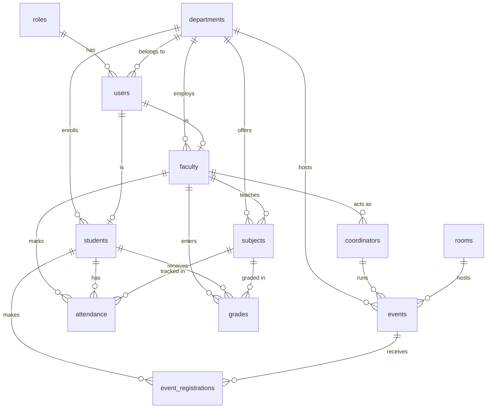

# Campus Connect — University Campus Management System (ERP)

A production-grade, role-based **Campus Management System** built with **React + TypeScript + Tailwind CSS** on a **Supabase (PostgreSQL)** backend. It models a real university ERP: departments, faculty, students, coordinators, subjects, rooms, events, attendance, grades, announcements and reports — with authentication, session persistence, and **Row Level Security (RLS)**-based authorization enforced at the database layer.

---

## ✨ Overview

Campus Connect gives every campus stakeholder a tailored, secure workspace:

- **Admin** — full control: users, departments, rooms, subjects, events, analytics.
- **Coordinator** — manages a department's events, students, faculty and reports.
- **Faculty** — teaches subjects, marks attendance, enters grades.
- **Student** — views attendance, grades, CGPA, registered events and announcements.

The authorization model is **defense-in-depth**: the UI hides what a role can't use, and the **database refuses** what a role isn't allowed to read or write — so security doesn't depend on the client.

---

## 🚀 Features

| Module | Capabilities |
| --- | --- |
| **Authentication** | Email/password via Supabase Auth, persistent sessions, silent token refresh, auto session restore on reload, protected routes |
| **RBAC** | 4 roles (admin, coordinator, faculty, student) enforced by Postgres RLS + UI guards |
| **Dashboards** | Role-specific dashboards rendering live database data |
| **User Management** | List/search/filter users, assign roles & departments, activate/deactivate (admin) |
| **Departments** | CRUD, department codes, head-of-department, per-department analytics |
| **Subjects** | CRUD, assign to department/semester/faculty, credits |
| **Rooms** | CRUD, capacity, type, availability status |
| **Events** | CRUD, coordinator/room assignment, student registrations |
| **Attendance** | Faculty marks; students view; coordinators/admin report |
| **Grades** | Internal/external/assignment/lab marks, final grade, CGPA |
| **Announcements** | Department-specific and campus-wide |
| **Reports** | Attendance, grades, department, faculty, student, event reports |
| **Cross-cutting** | Search, filters, pagination, loading/empty/error states, toasts, light/dark theme |

---

## 🛠️ Technologies

- **Frontend:** React 18, TypeScript, Vite, Tailwind CSS, Zustand (state), React Router v6, Framer Motion, Lucide icons, React Hot Toast, Zod (validation)
- **Backend:** Supabase — PostgreSQL, Auth (GoTrue), PostgREST, Row Level Security
- **Tooling:** ESLint, PostCSS, Autoprefixer

> **Why Supabase over a custom Express backend?** Supabase provides managed Postgres, JWT-based auth with bcrypt password hashing, automatic REST APIs (PostgREST), and row-level authorization — eliminating a large class of hand-rolled, error-prone backend code while keeping security *in the database* where it belongs.

---

## 🗄️ Database Schema

15 normalized tables (3NF). Identity is owned by Supabase Auth (`auth.users`); the application profile lives in `public.users`, linked by `auth_user_id`.

```
roles(id, role_name, description)
departments(id, department_name, department_code, hod_id→users, description)
users(id, auth_user_id→auth.users, username, email, full_name, phone, gender,
      role_id→roles, department_id→departments, status, profile_image)
faculty(id, user_id→users, employee_id, department_id→departments, designation)
students(id, user_id→users, roll_number, department_id→departments, semester, section, year)
coordinators(id, faculty_id→faculty, department_id→departments)
subjects(id, subject_name, subject_code, semester, department_id→departments, faculty_id→faculty, credits)
rooms(id, room_number, building, floor, capacity, room_type, status)
events(id, event_name, description, coordinator_id→coordinators, room_id→rooms,
       department_id→departments, start_date, end_date, status)
event_registrations(id, student_id→students, event_id→events, status)
attendance(id, student_id→students, subject_id→subjects, faculty_id→faculty, date, status)
grades(id, student_id→students, subject_id→subjects, faculty_id→faculty,
       internal_marks, external_marks, assignment_marks, lab_marks, final_grade, cgpa)
announcements(id, title, description, department_id→departments, created_by→users)
reports(id, report_type, generated_by→users, department_id→departments, payload)
audit_logs(id, user_id→users, action, entity, entity_id)
```

The full DDL — foreign keys, indexes, constraints, RLS policies, helper functions and the signup trigger — is in [`supabase/migrations/0001_campus_erp_baseline.sql`](supabase/migrations/0001_campus_erp_baseline.sql).

### ER Diagram



---

## 🔐 Authentication Flow

1. **Sign up / Sign in** → Supabase Auth (`/auth/v1/…`) issues a JWT access token + refresh token; the session is stored in `localStorage`.
2. A Postgres **trigger** (`handle_new_auth_user`) auto-creates the matching `public.users` row from signup metadata.
3. **On every app load**, `authStore.initialize()` runs:
   - restores the session (refreshing the token transparently if expired),
   - re-fetches the user's **profile + role + department** from the database (never trusting stale client state),
   - blocks deactivated accounts,
   - shows a loader until restore completes, so protected routes never flash or wrongly redirect.
4. **Route protection**: `AppLayout` renders a loader while `initializing`, then either renders the app or redirects to `/auth` — preserving the attempted route.

> **Role is always the DB's truth.** Because the profile (and role) is re-read from `users`+`roles` on every load, changing a user's role in the database is reflected on their next reload — no stale cache.

---

## 👥 Role-Based Access Control

Authorization is enforced by **Postgres RLS policies** using `SECURITY DEFINER` helper functions (`app_role()`, `app_user_id()`, `app_student_id()`, `app_faculty_id()`, `app_department_id()`) that avoid RLS recursion:

| Data | admin | coordinator | faculty | student |
| --- | --- | --- | --- | --- |
| Users | all (write) | own dept (read) | own dept (read) | self |
| Departments / Rooms / Subjects | write | subjects: write | read | read |
| Events | write | write | read | read |
| Attendance | all | own dept (read) | own subjects (write) | own (read) |
| Grades | all | own dept (read) | own subjects (write) | own (read) |
| Announcements | write | write | write | read |

The React UI mirrors these rules (role-conditional sidebar, route guards), but the **database is the final authority** — a crafted request from the wrong role is rejected by RLS.

---

## 📁 Folder Structure

```
src/
├── components/
│   ├── auth/         # AuthForm
│   ├── layout/       # AppLayout (route guard), Header, Sidebar
│   ├── dashboard/    # cards
│   └── ui/           # Button, Input, Card, Badge, Table, ThemeToggle, Avatar
├── pages/            # DashboardPage (role-branched), Users, Departments, Rooms,
│                     # Events, Grades, Attendance, Announcements, Reports, Settings…
├── services/         # entities.ts — typed repository layer (one per table)
├── store/            # Zustand stores (auth, theme, …)
├── lib/              # supabase.ts (client, auth, session, REST helpers), utils.ts
└── types/            # shared TypeScript types

supabase/migrations/  # 0001_campus_erp_baseline.sql (schema + RLS + seed)
```

**Architecture layers:** UI components → Zustand stores / page hooks → **service/repository layer** (`services/entities.ts`) → thin Supabase REST client (`lib/supabase.ts`) → PostgREST + RLS. Pages never call `fetch` directly; they go through the typed repositories.

---

## ⚙️ Setup

### Prerequisites
- Node 18+
- A Supabase project

### 1. Install
```bash
npm install
```

### 2. Environment
Copy `.env.example` → `.env` and fill in:
```bash
VITE_SUPABASE_URL=https://<project>.supabase.co
VITE_SUPABASE_ANON_KEY=<anon-key>
```
> The `service_role` key is **never** used in the frontend. It belongs only in server-side Edge Functions (e.g. admin user creation).

### 3. Apply the schema
In the Supabase **SQL Editor**, run [`supabase/migrations/0001_campus_erp_baseline.sql`](supabase/migrations/0001_campus_erp_baseline.sql).

### 4. First admin
- In **Authentication → Providers → Email**, disable "Confirm email" for local dev.
- Sign up once through the app.
- Promote yourself:
  ```sql
  update users set role_id = (select id from roles where role_name = 'admin')
  where email = 'you@example.com';
  ```

### 5. Run
```bash
npm run dev      # development
npm run build    # production build
npm run preview  # preview the build
```

---

## 🌍 Environment Variables

| Variable | Scope | Purpose |
| --- | --- | --- |
| `VITE_SUPABASE_URL` | client | Supabase project URL |
| `VITE_SUPABASE_ANON_KEY` | client | Public anon key (safe — RLS enforces access) |
| `SUPABASE_SERVICE_ROLE_KEY` | server only | Admin operations in Edge Functions — never bundled |

---

## 🚢 Deployment

- **Frontend:** `npm run build` → deploy `dist/` to Vercel / Netlify / Cloudflare Pages. Set the two `VITE_` env vars in the host dashboard.
- **Backend:** Supabase is already hosted; apply the migration to your production project. Turn **on** email confirmation for production.
- **Admin-created users:** deploy a Supabase Edge Function using the service-role key to provision accounts (`/auth/v1/admin/users` with `email_confirm: true`).

---

## 🎤 Interview-Ready Architecture Explanation

> "Campus Connect is a role-based university ERP. The frontend is a React + TypeScript SPA; the backend is Supabase — managed Postgres with auto-generated REST APIs. The defining decision is that **authorization lives in the database** via Row Level Security, not in application middleware. Every table has policies keyed off the authenticated user's role, resolved through `SECURITY DEFINER` helper functions to avoid policy recursion. The client is organized in layers — components, a typed repository/service layer, and a thin REST client — so data access is centralized and type-safe. Auth uses Supabase's JWT + refresh-token flow with a startup routine that restores the session and **re-reads the role from the database on every load**, so the source of truth is always the persisted user record."

### Common interview Q&A

- **Q: How do you prevent a user from reading another user's grades?**
  RLS on `grades`: a student can only `SELECT` rows where `student_id = app_student_id()`. Even a hand-crafted API call with their own JWT returns nothing for other students.
- **Q: How is the role kept in sync with the database?**
  It isn't cached authoritatively on the client. `initialize()` re-fetches `users`+`roles` on every load; login does the same. Change the role in SQL → next reload reflects it.
- **Q: Why did a role change once *not* show up (a real bug you fixed)?**
  A PostgREST embed of `departments` was ambiguous because two FKs exist between `users` and `departments` (`department_id` and `hod_id`). The query returned `300 PGRST201`, the fetch failed, and the code fell back to stale signup metadata. Fix: disambiguate with an explicit FK hint (`departments!users_department_id_fkey(...)`).
- **Q: How do you avoid RLS infinite recursion?**
  Policies call `SECURITY DEFINER` functions that read `users` with RLS bypassed, so evaluating a `users` policy doesn't re-trigger `users` policies.
- **Q: Where does password hashing happen?**
  In Supabase Auth (GoTrue), using bcrypt — never in application code, never in plaintext.

---

## 🧭 Future Enhancements

- Supabase Edge Function for admin user provisioning + password reset emails.
- Realtime subscriptions (live attendance/announcements) via Supabase Realtime.
- CSV/PDF export for reports.
- Timetable & room-booking conflict detection.
- Audit-log viewer UI.
- Unit/integration tests (Vitest + Testing Library) and CI.

---

## 📝 Resume Description

> **Campus Connect — University Management System (React, TypeScript, Supabase/PostgreSQL).**
> Built a role-based campus ERP with four user roles and database-enforced authorization via Postgres Row Level Security. Implemented JWT session persistence with silent refresh, a typed repository/service layer over PostgREST, and normalized 15-table schema with foreign keys, indexes and triggers. Delivered role-specific dashboards, full CRUD modules (users, departments, subjects, rooms, events, attendance, grades, announcements) with search/filter/pagination, and light/dark theming.

---

Built with attention to security, data integrity, and clean architecture.
